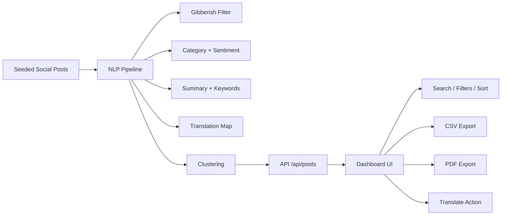

# Zebvo Passport Social Media Dashboard

This project is a full-stack Next.js dashboard for passport-related social content from the last 24 hours. It demonstrates scraping-oriented ingestion, NLP enrichment, multilingual translation, clustering, filtering, and export flows in a single UI.

## What is included

- Modular post ingestion with seeded social content from major platforms.
- NLP pipeline for category detection, gibberish removal, sentiment, summary generation, and clustering.
- One-click translations for English, Hindi, Punjabi, Spanish, French, German, Arabic, Chinese, Russian, and Japanese.
- Search, filters, sorting, CSV export, and PDF export.
- API routes for posts, translation, and exports.
- Clean dashboard UI with responsive layout and a strong visual identity.

## Local setup

```bash
npm install
npm run dev
```

Open `http://localhost:3000`.

## Scripts

- `npm run dev` starts the development server.
- `npm run build` creates the production build.
- `npm run start` runs the production server.
- `npm run lint` runs the Next.js lint checks.
- `npm run typecheck` runs TypeScript only checks.

## Architecture



## API

### `GET /api/posts`

Query params:

- `q`
- `platform`
- `category`
- `language`
- `sentiment`
- `region`
- `creator`
- `sort`
- `direction`

Response:

- `stats` with raw, meaningful, removed, and cluster counts.
- `posts` with NLP-enriched records.
- `clusters` with grouped similar posts.

### `POST /api/translate`

Body:

```json
{
  "postId": "reddit-u-harpreet-tech-2-fresh-application-slot",
  "language": "hi"
}
```

or:

```json
{
  "text": "Passport renewal is delayed",
  "language": "fr"
}
```

### `GET /api/export/csv`

Returns the filtered result set as CSV.

### `GET /api/export/pdf`

Returns a printable PDF report of the filtered result set.

## Notes

- The current implementation uses a high-fidelity demo dataset with the same data flow you would use for real public-source scraping.
- To switch to live platform adapters, replace `src/lib/data.ts` with connector code and keep the API and UI contracts unchanged.
